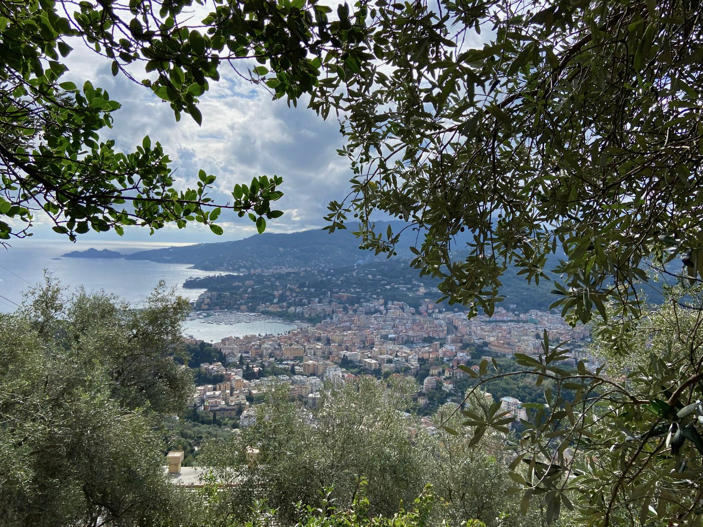

Die Casa Rosa ist eine kleine, charmante Dreizimmerwohnung, die sich seit vier Generationen im Familienbesitz befindet. Neben einem grosszügigen Wohnzimmer mit Esstisch und Sofa verfügt die Wohnung über ein Schlafzimmer mit Doppelbett sowie ein weiteres kleines Schlafzimmer mit einem Einzelbett und einer zusätzlichen Matratze.

Die Küche ist voll ausgestattet. Ausserdem verfügt die Wohnung über eine Waschmaschine, die sich in der Küche befindet.

Zur Wohnung gehört zudem eine grosszügige Dachterrasse, die über eine private Aussentreppe zugänglich ist.

/// caption
Blick von Sant'Ambrogio auf Rapallo
///

